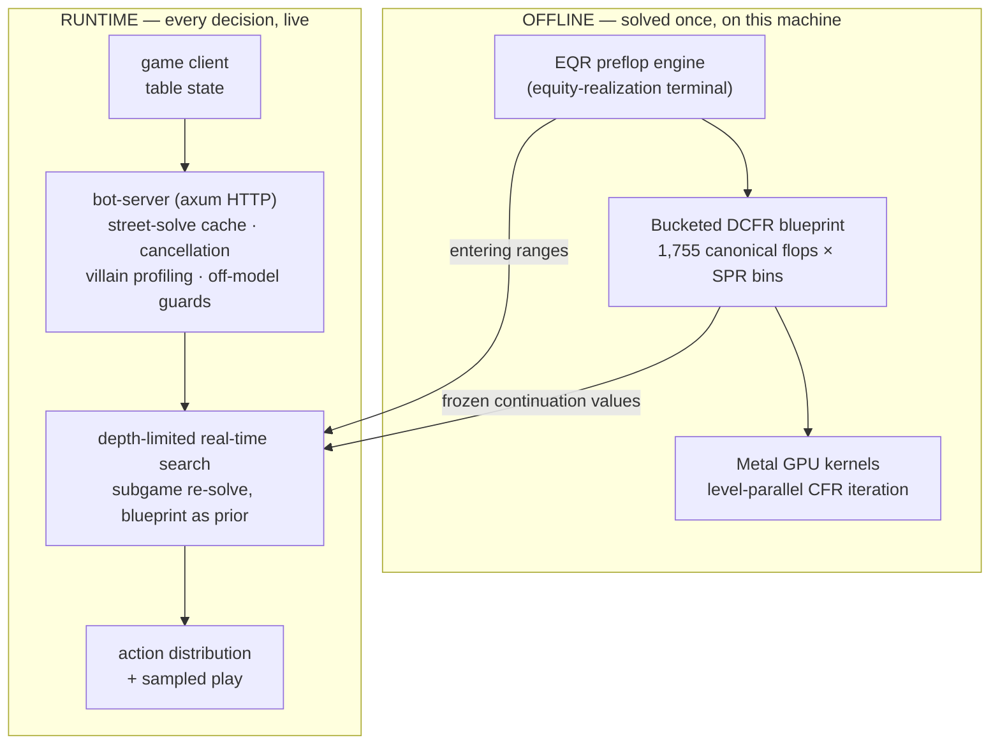

# Pluribus Jr — a 6-max NLHE solver and autonomous bot on one Mac

A complete 6-max No-Limit Hold'em solver and autonomous playing bot, written from scratch in Rust with hand-written Metal GPU kernels: CFR blueprint solving, real-time depth-limited search, and an HTTP decision server that played live online games across five autonomous accounts.

All of it — solving, search, serving — runs on a single Apple Silicon machine.

Live result: +84 bb/100 pre-rake over a ~4,700-hand window against live opponents. Not statistically verified at that variance (σ ≈ 400 bb/100 in the deep-ante games; confirmation would take ~8,600+ hands), and post-rake, at realistic bankroll constraints, the capital required to harvest a poker edge of this size is the binding constraint — as it is for every poker edge.

~130k lines of Rust, 381 commits over four months, four Metal shaders, 18 GPU parity bugs found and fixed via invariant gates, one mid-project architectural pivot that cut preflop solve time from weeks to minutes.

---

## Background: the Pluribus architecture

Pluribus (Brown & Sandholm, Science 2019) is the reference system for superhuman multi-player no-limit poker. Its design rests on a decomposition:

```
OFFLINE:  solve a "blueprint" strategy on an abstracted version of the game
          (card-abstraction buckets, limited bet-size menu) using CFR variants

ONLINE:   at each decision, build a subgame around the current spot and
          re-solve it with depth-limited search; the blueprint provides
          the prior (opponent ranges) and the continuation values at the
          search boundary
```

Two properties make this work. First, the blueprint is reach-independent — it is solved once against a structural prior, and actual entering ranges are injected at query time, so one blueprint serves every seat, stack depth, and table composition. Second, the search boundary doesn't need the rest of the game solved: it freezes to a small set of precomputed continuation strategies (Pluribus used k=4 biased variants per opponent, selected adversarially), which bounds the re-solve to the current street's subtree.

This project is that architecture rebuilt to fit one machine instead of a 64-core cluster, which changes almost every parameter choice — and in one place, the algorithm itself.

## The system



**Offline**, the solver computes a strategy blueprint over an abstracted game: 1,755 canonical flops (the exact count of suit-isomorphism classes — verified, not copied), card-abstraction buckets, a capped bet-size menu. Iteration is DCFR (discounted CFR), level-parallel on the GPU, with custom kernels for terminal showdown evaluation.

**Live**, every decision triggers a depth-limited subgame re-solve: the actual betting tree around the current spot, solved fresh, with the blueprint's continuation values as the boundary condition and entering ranges injected at query time.

### The one algorithmic departure: preflop

Pluribus solved preflop and postflop together (at 64-core scale). On one machine, the coupled preflop↔postflop solve was measured at ~219 hours per iteration — infeasible. The standard alternative is to buy preflop charts; this project instead built a standalone preflop solver whose terminal valuation is an **equity-realization model** (EQR): for each (hand, flop, caller count, SPR bin), a Monte Carlo model of how equity converts to EV under continued play, conditioned on opponents who actually continue (a selection effect that captures multiway equity thinning). Real-time search restores range-dependence at the table, so the decoupling loses less than it appears to: preflop solve time went from weeks to minutes, and the entering ranges the search consumes come from the EQR solution.

### Components

| Crate | LOC (approx) | Role |
|---|---|---|
| `solver-core` | 90k | CFR/DCFR/MCCFR engines, game tree, card abstraction, showdown & rake settlement (side pots, uncalled bets, no-flop-no-drop), Metal GPU layer |
| `play-harness` | 20k | Runtime API, blueprint↔live seam, self-play engine, gate test suite |
| `bot-server` | 5k | Axum HTTP decision server — one request per decision point, no server-side game state |
| `solver-cli` | 10k | Fill/blueprint/solve entry points, probes, benches |

### Measured results

| Result | Number |
|---|---|
| Live-5 multiway search on GPU (cluster-mass kernels + subgame rooting) | 104.8 ms/iter — 39× vs MC sampling, 216× vs full enumeration |
| Off-grid turn decision latency (warm-started flop sweeps) | 28 s → 0.8 s |
| Terminal sampling vs exhaustive ground truth (B=8, M=8000) | 0.32% mean error, clean 1/√M scaling |
| Fold-mass computation via k23 cluster kernels | 118× factored at production deck |
| Blueprint u8 quantization | 4× smaller, 0.07% strategy error, mmap-random-access preserved |
| GPU parity bugs found by invariant gates | 18 (byte offsets, `#[repr(C)]` reordering, regret-floor drift, side-pot cascades) |

## Method

The development process is legible in the commit history and is arguably the most reproducible part of the project:

- **Measure before building.** Every major optimization was preceded by a priced measurement: the co-solve cost (219h/iter), the terminal-enumeration scaling law (O(B^K), ~B^3.8 at live-5), the MCCFR rebuild (net 2.9× against a 10× bar — rejected), GS14 coarsening (the isomorphism classes are the floor — rejected), joint vs per-opponent continuation selection (joint measured 5× worse — rejected). Rejected branches remain in the log with their numbers.
- **Gates over judgment.** The CPU reference is the source of truth for every GPU kernel; each carries a bit-exact or bounded-error parity gate. The clean-room rules engine caught a rank-truncation bug on its first run. An accounting-invariant check (stack deltas vs recorded P&L) later caught contamination in the live-data analysis itself.
- **Probes before solves.** Terminal-model changes were iterated in seconds-scale probes ("does AA's realized EV drop multiway?") before paying for hour-scale CFR runs.
- **Honest intermediates.** STATUS documents record failures alongside successes; several commits exist specifically to record a retraction (e.g., a range-insensitivity finding later refuted as a probe artifact).

## Architecture history

The commit log divides into five phases:

**1. GPU-native MCCFR (May).** GPU-first MCCFR with brute-force showdown oracles for 3–5 opponents. Ended with the deletion of the legacy CUDA kernels; `vcfr.metal` became the single GPU site.

**2. Blueprint machinery and the co-solve wall (early June).** Bucketed-oracle blueprint built, then the coupled preflop↔postflop solve priced at ~219 h/iter. The B-ladder experiments mapped the terminal cost law (O(B^K)) that constrained every later choice.

**3. The EQR pivot (mid-June).** The co-solve was shown unnecessary given real-time search; preflop decoupled via the equity-realization terminal, postflop moved to depth-limited search with frozen per-opponent continuation values.

**4. Runtime hardening (late June).** Decision API went live: stateless per-decision HTTP, street-solve caching, LRU-bounded caches after OOM under fleet load, cooperative cancellation after zombie solve threads were found burning ~13 cores post-timeout.

**5. Multiway GPU frontier (July).** Live-5 search moved fully to GPU: cluster-mass kernels (pairs + order-consistent triples, 118× factoring), subgame rooting, live-5 iterations 32→48, off-grid turn latency closed.

## Building it

Requirements: macOS on Apple Silicon (M-series), 32 GB+ unified memory, Rust stable, Xcode CLT for Metal.

```bash
cargo build --release --workspace

# decision server with GPU search
CONN_BP=blueprint_conn_v5 CONN_GS14=gs14_blueprint_cache GPU_SEARCH=1 \
  cargo run --release -p bot-server --features metal

# full gate suite
cargo test --release --workspace
```

Blueprint artifacts regenerate from `solver-cli` entry points (hours to days on one machine; see STATUS docs). Performance envelope on M4 Max / 36 GB: ~3–4 s warmup, same-street follow-up decisions in milliseconds (street-solve cache), ~0.8 s off-grid turns, live-5 search on GPU.

The runtime API contract is documented in `docs/RUNTIME_API.md`; the client-side integration contract (units, `to_call` semantics, pot accounting) in `docs/CLIENT_TO_CALL.md`.

## Status

This repository is a completed research project, published as-is. **It will not be maintained.**

## License

MIT.
